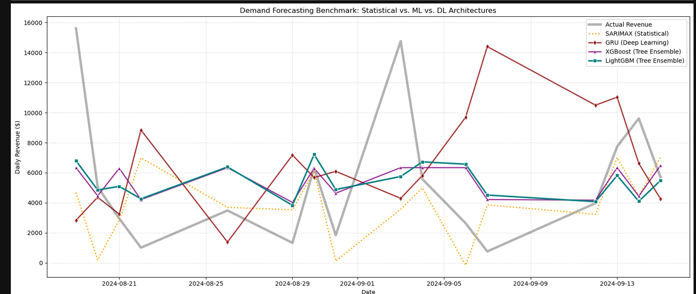
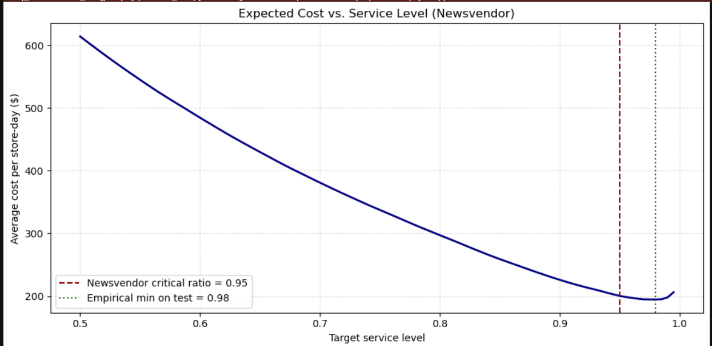

# Retail Demand Forecasting & Safety-Stock Optimization

Store-level daily revenue forecasting on retail transaction data, followed by an inventory step that turns forecasts into order quantities (`Q* = D̂ + z·σₑ`) at a target service level, with a newsvendor cost analysis.

**Stack:** Python (pandas, statsmodels, LightGBM, XGBoost, PyTorch, scikit-learn, SciPy), SQL (SQLite dialect)

---

## Key findings

- **Demand is hard to forecast.** At the global level the ACF/PACF are close to flat, so past sales say little about future sales. At the store level, daily revenue swings between roughly $1k and $15k.
- **Tree ensembles were the best models, and they are tied.** Tuned LightGBM and XGBoost reach almost the same out-of-sample RMSE, and both behave like conservative, mean-reverting forecasters that miss the extreme spikes.
- **The GRU did not help.** With ~2.7k training rows, it overfit and had the highest RMSE.
- **Point forecasts alone are a poor ordering policy.** Ordering exactly the forecast covers demand only ~58% of the time.
- **A textbook normal safety-stock rule undershoots its target.** Targeting 95% with `z = 1.645` achieved 92.6%, because forecast errors have heavier tails than a normal distribution. Using each store's empirical error quantile got closer (94.3%) at lower cost.

## Data

Retail transaction data (`Walmart.csv`, ~9 months of 2024) with store, date, unit price, quantity, promotion and holiday indicators. Transactions are aggregated to **store × day** revenue. Missing store-days are treated as zero sales.

<!-- TODO: add the dataset link (e.g. Kaggle URL) and a data/ folder note -->
The raw CSV is not included in this repo. Download it from the source above and place it in `data/Walmart.csv`.

## Approach

1. **Cleaning and aggregation:** parse timestamps, compute `revenue = unit_price × quantity_sold`, aggregate to store-day and global-day series.
2. **Feature engineering:** calendar features (day of week, weekend, month, day of month), lags (1, 7, 28 days), 7-day rolling mean/std (shifted by one day to avoid leakage), holiday and promotion flags.
3. **EDA:** distribution and outlier checks by month and weekday, ACF/PACF. A log transform was tried and rejected because it introduced left skew.
4. **Models benchmarked** on the same 30-day out-of-sample window:
   - SARIMAX with holiday/promotion exogenous variables (statistical baseline)
   - LightGBM with grid search (81 candidates, 3-fold CV)
   - XGBoost with grid search (54 candidates, 3-fold CV)
   - GRU (PyTorch, 14-day sequences) as a deep-learning extension
5. **Inventory step:** forecast errors → `σₑ` per store → order-up-to level `Q*`, evaluated on service level and a newsvendor cost function.

## Results

Out-of-sample, 30-day window, all stores pooled:

| Model | RMSE ($) | Notes |
|---|---|---|
| LightGBM (default) | 3,994.83 | before tuning |
| **LightGBM (tuned)** | **3,856.84** | |
| **XGBoost (tuned)** | **3,851.92** | statistically indistinguishable from LightGBM |
| GRU | 5,414.56 | overfit; small tabular dataset |
| SARIMAX | n/a (single store) | produces near-zero and negative forecasts on zero-sales days |

<!-- TODO: add a naive baseline row (store mean / same weekday last week) once run, and report all models against it. -->



### Inventory policy comparison

Evaluated on the same test window. Costs use the assumptions below.

| Policy | Service level | Avg cost / store-day ($) | Avg order level ($) |
|---|---|---|---|
| Point forecast (no buffer) | 57.7% | 614.05 | 4,761 |
| Normal rule, 95% target (`z = 1.645`) | 92.6% | 200.39 | 10,967 |
| Newsvendor, empirical error quantile | 94.3% | 189.79 | 11,277 |



**Reading this table:** forecast error is large relative to demand (σₑ is on the order of $2k–5k per store against average daily revenue near $4.8k), so the safety buffer more than doubles the order level. That is a property of how forecastable this data is, not a tuning failure.

### Cost assumptions (placeholders)

The dataset contains no cost information. The newsvendor analysis uses **assumed** per-$1-of-revenue costs:

- Cost of unmet demand (`COST_UNDER`): **0.38**
- Cost of surplus stock (`COST_OVER`): **0.02**
- Critical ratio = 0.38 / (0.38 + 0.02) = **0.95**, chosen to be consistent with a 95% service-level target

The "stockout is 19× costlier than holding" statement is a consequence of these assumptions, not an empirical finding. Change the two constants in the notebook to rerun the analysis with real margins and holding rates.

## Limitations

- **Optimistic service levels:** `σₑ` and the empirical quantiles are estimated on the same 30-day window the policy is evaluated on. A rolling-origin estimate (errors from earlier folds applied to later windows) would give an honest out-of-sample service level.
- **Small per-store samples:** ~16 test days per store, so per-store service levels are noisy (one miss moves the figure by several points). Pooled results are more reliable than per-store ones.
- **Non-temporal CV:** hyperparameter search uses standard 3-fold CV, which can leak future information. Differences of a few dollars between tuned models are within noise.
- **Revenue, not units:** the target is revenue in dollars. A real replenishment system would forecast units.
- **Normality assumption:** the Z-rule assumes roughly normal errors; the results above show it does not hold here.

## SQL

`sql/forecasting_pipeline.sql` (SQLite dialect) implements the data layer in SQL:

- `store_daily`: store × day aggregation
- `store_daily_full`: gap-filled calendar spine
- `model_features`: lags, 7-day rolling mean/std (excluding the current day), calendar features
- `safety_stock`: `Q* = D̂ + 1.645·σₑ` per store, with a coverage flag

Load the CSV into SQLite and run it:

```python
import sqlite3, pandas as pd

df = pd.read_csv("data/Walmart.csv")
df["transaction_date"] = pd.to_datetime(df["transaction_date"], format="%m/%d/%Y %H:%M").dt.strftime("%Y-%m-%d")
for col in ["promotion_applied", "holiday_indicator"]:
    df[col] = df[col].isin([True, "True", "true", 1, "1"]).astype(int)

con = sqlite3.connect("forecasting.db")
df.to_sql("transactions", con, if_exists="replace", index=False)
con.executescript(open("sql/forecasting_pipeline.sql").read())

features = pd.read_sql("SELECT * FROM model_features", con)
```

The `safety_stock` view expects a table `lgbm_forecasts(store_id, transaction_date, actual, d_hat)` written back from Python; see the comments in the SQL file.

## Repo structure

```
README.md
notebooks/Forecasting_data.ipynb   # full analysis with outputs
sql/forecasting_pipeline.sql       # SQL data layer
images/                            # plots used in this README
requirements.txt
data/                              # place Walmart.csv here (not tracked)
```

## How to run

```bash
pip install -r requirements.txt
# place Walmart.csv in data/, update the path in the first notebook cell
jupyter notebook notebooks/Forecasting_data.ipynb
```

Suggested `requirements.txt`: `pandas numpy matplotlib seaborn statsmodels scikit-learn scipy lightgbm xgboost torch`

## Possible next steps

- Add naive baselines (store mean, same weekday last week) and report every model relative to them
- Forecast units instead of revenue
- Estimate `σₑ` from rolling-origin validation for honest service-level evaluation
- Quantile regression (LightGBM/XGBoost) to predict the order quantile directly instead of `D̂ + z·σₑ`
